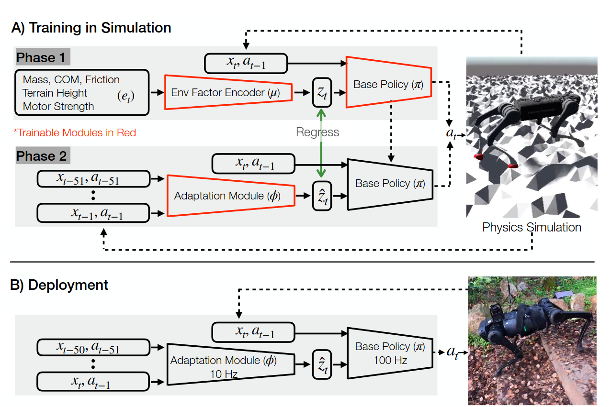

# Rapid Motor Adaptation

This experiment concerns itself with the paper **RMA: Rapid Motor Adaptation for Legged Robots**, and attempts to implement it. The schematic of the methods can be seen below



For the original paper see [here](https://arxiv.org/abs/2107.04034), or for a different application of the same method, see [here](https://arxiv.org/abs/2603.04531).

For a video lecture to explain the method, see the video material [here](https://www.youtube.com/watch?v=Hp1WBWghrak&list=PLoROMvodv4rPwxE0ONYRa_itZFdaKCylL&index=17).

## Assignment interpretation

Implement Rapid Motor Adaptation (RMA) in this experiment folder and test it on MuJoCo Playground's Spot locomotion task.

I interpret this as a simulation-first implementation, not real Spot deployment. The implementation should reproduce the paper's two-stage training idea:

1. Train a privileged base policy `pi` and environment factor encoder `mu` with PPO. The policy receives the current proprioceptive state, previous action, and latent extrinsics `z = mu(e)`, where `e` contains randomized environment factors such as friction, payload, center of mass shift, motor strength, and terrain height.
2. Freeze `pi` and `mu`, then train an adaptation module `phi` with supervised learning on on-policy rollouts. `phi` predicts `z_hat` from recent state-action history, so deployment can run without privileged environment factors.
3. Evaluate the deployed RMA policy as `pi(x_t, a_{t-1}, phi(history))` on held-out Spot domain randomization settings and compare it to ablations.

For "spot robot locomotion", target `SpotFlatTerrainJoystick`. `SpotJoystickGaitTracking` can be a later comparison once the core RMA pipeline works.

## Decisions

- Task: use `SpotFlatTerrainJoystick`.
- Scope: simulation only; no real-robot export/deployment path in the first implementation.
- Control rate: keep MuJoCo Playground's default Spot control rate, `ctrl_dt = 0.02` / 50 Hz.
- Adaptation history: use 25 state-action steps, matching the paper's approximate 0.5 second history window at 50 Hz.
- Terrain: include rough terrain in milestone one.
- Code placement: keep all RMA code local to `experiments/rapid_motor_adaptation` for now. Promote reusable pieces into `mjxsim` only after the experiment works.
- Compute budget: assume the currently available local machine with NVIDIA 5080 drivers installed. Scripts should still support small CPU smoke runs, but the primary development/training path can target GPU-accelerated JAX/PPO.

## Spot task choice

`SpotFlatTerrainJoystick` and `SpotJoystickGaitTracking` are both Spot locomotion tasks, but they optimize different control problems:

- `SpotFlatTerrainJoystick`: the policy tracks linear and yaw velocity commands. It learns its own gait implicitly from rewards such as velocity tracking, posture, energy, foot slip, foot clearance, and air time. This is the better first RMA target because the adaptation module can focus on dynamics changes like friction, payload, motor strength, and terrain without also disentangling explicit gait-conditioning inputs.
- `SpotJoystickGaitTracking`: the policy also receives/samples gait parameters such as gait type, gait frequency, phase, and foot height, and is rewarded for matching the requested gait pattern. This is useful later if we want controlled trot/walk/pace/bound/pronk behavior, but it adds another conditioning channel and makes it harder to tell whether failures come from RMA adaptation or gait tracking.

So the first milestone should be RMA for robust command-following locomotion on Spot. After that is stable, gait-tracking RMA can reuse most of the environment randomization, network, adaptation, and evaluation code.

## Paper details to preserve

- Base policy input in the paper: 30-D robot state, 12-D previous action, 8-D extrinsics.
- Environment factor input in the paper: 17-D vector with payload mass and position, motor strength, friction, and local terrain height.
- Base policy output: 12 target joint positions, converted to torques by the simulator's PD controller.
- Adaptation input: about 0.5 seconds of recent state-action history, `k = 50` at the paper's 100 Hz controller rate.
- Deployment: base policy runs fast and consumes the latest extrinsics estimate; adaptation can update more slowly.
- Baselines to report: RMA, RMA without adaptation, domain-randomized policy without latent adaptation, and privileged expert where possible.

MuJoCo Playground Spot currently uses `ctrl_dt = 0.02`, so its control rate is 50 Hz rather than the paper's 100 Hz. To keep the history window close to 0.5 seconds, use `history_len = 25` for the default Spot task unless we explicitly change the environment to 100 Hz.

## Implementation plan

### 1. Create an experiment package

Add a small package under `experiments/rapid_motor_adaptation/`:

- `config.py`: experiment defaults, environment names, randomization ranges, training budgets, checkpoint paths.
- `env.py`: Spot RMA wrapper around MuJoCo Playground's Spot environment.
- `networks.py`: Flax/JAX modules for `mu`, `pi`, value function, and `phi`.
- `train_phase1.py`: PPO training for privileged base policy plus environment encoder.
- `train_phase2.py`: supervised adaptation-module training from on-policy rollouts.
- `evaluate.py`: held-out perturbation evaluation and baseline comparison.
- `checkpoints/` or `.runs/`: ignored output directory for policies, metrics, and plots.

The files should be local to this experiment unless a reusable helper clearly belongs in `mjxsim`.

### 2. Build the Spot RMA environment wrapper

Start from `mujoco_playground._src.locomotion.spot.joystick.Joystick` / `SpotFlatTerrainJoystick`.

The wrapper needs to:

- Keep the normal Playground observation for training compatibility.
- Add a compact paper-style proprioceptive state used by RMA. For Spot this should include joint positions, joint velocities, torso roll/pitch or gravity representation, foot contacts, commands if command tracking remains part of the task, and previous action.
- Track previous actions and state-action history in `state.info`.
- Expose privileged environment factors `e` in `obs["privileged_state"]` or a dedicated observation key.
- Implement domain randomization for:
  - floor friction,
  - base payload mass,
  - payload center-of-mass offset,
  - per-joint motor strength/action scale or actuator gain multiplier,
  - optionally `Kp`/`Kd`,
  - local terrain height once rough terrain is available.
- Store the sampled factors in `state.info["env_factors"]` so `mu(e)` can train and `phi` can use `mu(e)` as target.

Spot's installed Playground package exposes only flat-terrain Spot XMLs. Because rough terrain is part of milestone one, add local Spot rough-terrain assets in this experiment folder. The likely path is to adapt the hfield/rough-terrain XML pattern used by other MuJoCo Playground locomotion tasks and register a local `SpotRmaRoughTerrainJoystick` environment without modifying the installed package.

### 3. Phase 1: privileged PPO

Train `pi` and `mu` jointly:

- `z = mu(e)`, with `z_dim = 8`.
- `action = pi(base_obs, previous_action, z)`.
- Critic can receive the same input as the actor, or a richer privileged observation if this matches the Playground PPO setup.
- Use Brax/Playground PPO machinery where practical, but a custom network factory may be required because `mu(e)` must be part of the policy computation.
- Begin with GPU-targeted smoke budgets on the current machine, while keeping a CPU fallback for quick shape and import checks:
  - smoke: hundreds to thousands of steps, validates shapes/checkpoints;
  - development: 1-10M steps;
  - serious run: 100M+ steps, using the NVIDIA 5080 for practical turnaround.

The first milestone is not paper-level performance. It is a stable PPO loop whose policy depends on `z` and trains on randomized Spot dynamics.

### 4. Phase 2: adaptation training

Freeze `pi` and `mu`.

Collect on-policy rollouts where actions come from `pi(base_obs, previous_action, z_hat)`, and train `phi(history)` to regress to `z = mu(e)` with MSE.

Implementation details:

- Maintain a fixed-length history buffer of state-action pairs.
- Use `history_len = 25` for the default 50 Hz Spot controller.
- Start with a simple MLP over flattened history for the first working version.
- Then add the paper-style temporal model: per-step embedding MLP followed by 1-D CNN over the history window.
- Log both adaptation loss and downstream rollout reward, because low latent MSE is only useful if it recovers locomotion performance.

### 5. Evaluation

Evaluate these policies on held-out perturbations:

- `RMA`: `pi(base_obs, previous_action, phi(history))`.
- `RMA w/o adaptation`: `pi(base_obs, previous_action, default_or_zero_z)`.
- `Privileged expert`: `pi(base_obs, previous_action, mu(e))`.
- `Domain-randomized baseline`: policy trained without `z`, if time permits.

Report:

- episode return,
- success rate / early termination rate,
- time to fall,
- command-tracking error,
- distance traveled,
- torque/energy cost,
- adaptation latency after sudden perturbation if we implement mid-episode payload/friction changes.

Test grids should include at least friction, payload mass, payload COM offset, and motor-strength ranges. If rough terrain is added, include terrain height variation.

### 6. Tests and verification

Add tests that can run quickly in CI or locally:

- Import and registration test for the RMA Spot environment.
- Reset/step smoke test with one environment and deterministic seed.
- Observation-shape test for base observation, privileged factors, history, `z`, and actions.
- Network forward-pass test for `mu`, `pi`, and `phi`.
- Tiny phase-1 training smoke test that runs a few PPO updates and writes a checkpoint.
- Tiny phase-2 training smoke test using a small collected rollout buffer.
- Evaluation smoke test that runs one short episode for each baseline mode.

Full training should remain a manual experiment command because it is compute-heavy.

## Initial milestones

1. Minimal Spot RMA environment wrapper with mass/friction/motor randomization and privileged factor output.
2. Network modules and shape tests.
3. Phase-1 PPO smoke training.
4. Phase-2 supervised adaptation smoke training.
5. Evaluation script with RMA vs no-adaptation vs privileged expert.
6. Rough-terrain Spot XML/assets and terrain-height factor.
7. Longer training run and result table.

## Current implementation

The first local component slice is implemented:

- `config.py`: shared dimensions and defaults.
- `terrain.py`: deterministic rough hfield asset generation and local Spot rough-terrain XML.
- `env.py`: `RmaSpotJoystick`, `make_env`, and `domain_randomize`.
- `networks.py`: Flax modules for `mu`, `pi`, value function, and `phi`.
- `smoke.py`: environment and network smoke runner.
- `train_phase1.py`: PPO training for the privileged encoder, base policy, and value function.
- `train_phase2.py`: supervised training for the adaptation module from Phase-1 rollouts.
- `evaluate.py`: rollout evaluation for privileged, RMA, and no-adaptation modes.
- `test_rma_components.py`: focused component tests for network shapes, environment reset/step, rough terrain, and domain randomization.

Useful commands:

```bash
UV_CACHE_DIR=/tmp/uv-cache JAX_PLATFORMS=cpu uv run --no-sync python -m experiments.rapid_motor_adaptation.smoke --steps 1
UV_CACHE_DIR=/tmp/uv-cache JAX_PLATFORMS=cpu uv run --no-sync python -m experiments.rapid_motor_adaptation.smoke --flat --steps 1
```

On a working NVIDIA 5080 CUDA 13 setup, omit `JAX_PLATFORMS=cpu` to let JAX use the GPU.

Tiny end-to-end training/evaluation commands:

```bash
UV_CACHE_DIR=/tmp/uv-cache uv run --no-sync python -m experiments.rapid_motor_adaptation.train_phase1 --iterations 2 --num-envs 4 --unroll-length 8 --output experiments/rapid_motor_adaptation/.runs
UV_CACHE_DIR=/tmp/uv-cache uv run --no-sync python -m experiments.rapid_motor_adaptation.train_phase2 --phase1 experiments/rapid_motor_adaptation/.runs/phase1.pkl --iterations 2 --num-envs 4 --steps-per-iteration 8 --output experiments/rapid_motor_adaptation/.runs
UV_CACHE_DIR=/tmp/uv-cache uv run --no-sync python -m experiments.rapid_motor_adaptation.evaluate --checkpoint experiments/rapid_motor_adaptation/.runs/phase2.pkl --mode rma --num-envs 4 --steps 32
UV_CACHE_DIR=/tmp/uv-cache uv run --no-sync python -m experiments.rapid_motor_adaptation.evaluate --checkpoint experiments/rapid_motor_adaptation/.runs/phase2.pkl --mode privileged --num-envs 4 --steps 32
UV_CACHE_DIR=/tmp/uv-cache uv run --no-sync python -m experiments.rapid_motor_adaptation.evaluate --checkpoint experiments/rapid_motor_adaptation/.runs/phase2.pkl --mode no_adapt --num-envs 4 --steps 32
```

Full Warp-backend training launchers:

```bash
./experiments/rapid_motor_adaptation/run_phase1_full.sh
./experiments/rapid_motor_adaptation/run_phase2_full.sh
./experiments/rapid_motor_adaptation/run_evaluate_full.sh
```

Training writes progress CSVs alongside checkpoints:

- `phase1_progress.csv`: PPO reward, done rate, losses, entropy, and KL.
- `phase2_progress.csv`: adaptation MSE and rollout reward.

Watch live progress from another terminal:

```bash
tail -f experiments/rapid_motor_adaptation/.runs/full_warp/phase1_progress.csv
```

Generate PNG plots:

```bash
uv run --no-sync python -m experiments.rapid_motor_adaptation.plot_progress --run-dir experiments/rapid_motor_adaptation/.runs/full_warp
```

Run the PyTorch/skrl middle-ground Phase-1 trainer:

```bash
bash experiments/rapid_motor_adaptation/run_all_skrl.sh 1000000 1024
```

This uses the same MuJoCo Playground/JAX simulation backend, but exposes a flat
RMA observation to skrl and trains the PyTorch/skrl RMA policy/value models from
`torch_networks.py`.

Export a trained JAX/Flax RMA checkpoint to equivalent PyTorch modules:

```bash
uv run --no-sync python -m experiments.rapid_motor_adaptation.export_jax_to_torch \
  --checkpoint experiments/rapid_motor_adaptation/.runs/full_warp/phase2.pkl \
  --output experiments/rapid_motor_adaptation/.runs/full_warp/rma_torch.pt
```

Use a Phase-2 checkpoint for the complete RMA policy because it contains the
trained adaptation encoder. The exporter saves a PyTorch `state_dict`, copied
`log_std`, layout metadata, and JAX-vs-Torch parity metrics.
On NVIDIA GPUs the parity check can exceed the strict `1e-5` CPU-level tolerance
because JAX/PyTorch may use different matmul/conv precision paths. The exporter
warns above `--strict-tolerance` and only fails above `--warning-tolerance`
(default `1e-2`).

The full scripts default to rough terrain, `cfg.impl = "warp"`, and write to
`experiments/rapid_motor_adaptation/.runs/full_warp`. `TIMESTEPS` means
environment transitions and is converted to PPO iterations as
`ceil(TIMESTEPS / (NUM_ENVS * UNROLL_LENGTH))`. Override run size without
editing files, for example:

```bash
TIMESTEPS=1000000 NUM_ENVS=1024 ./experiments/rapid_motor_adaptation/run_phase1_full.sh
ITERATIONS=100 NUM_ENVS=128 ./experiments/rapid_motor_adaptation/run_phase2_full.sh
```

If Warp reports contact/constraint buffer overflows, increase these values:

```bash
NACCDMAX=8192 NJMAX=256 NCONMAX=131072 TIMESTEPS=1000000 NUM_ENVS=1024 ./experiments/rapid_motor_adaptation/run_phase1_full.sh
```

`NACONMAX` and `NACCDMAX` are separate Warp pools. `NACONMAX` controls general
contacts, while `NACCDMAX` controls the CCD-specific pool used by convex and
hfield collision. The full launchers print both values and ensure
`NACONMAX >= NACCDMAX`.

If Warp reports `Warning: opt.ccd_iterations, currently set to ..., needs to be
increased`, raise the solver iteration budget separately:

```bash
CCD_ITERATIONS=200 bash experiments/rapid_motor_adaptation/run_all_skrl.sh 1000000 1024
```

Use `CCD_ITERATIONS=300` or `CCD_ITERATIONS=500` if the warning persists in a
long rough-terrain run. This is a convergence knob, not a buffer-size knob, so
it complements `NACCDMAX` rather than replacing it.

To debug the effective allocation on the GPU machine:

```bash
NACCDMAX=26384 NACONMAX=26384 NJMAX=556 NUM_ENVS=512 uv run --no-sync python -m experiments.rapid_motor_adaptation.debug_buffers --num-envs 512 --steps 1 --naconmax 26384 --naccdmax 26384 --njmax 556
```

For CPU-only debugging, override the backend:

```bash
JAX_PLATFORMS=cpu EXTRA_ARGS="--impl jax --flat" ITERATIONS=1 NUM_ENVS=1 UNROLL_LENGTH=1 EPOCHS=1 ./experiments/rapid_motor_adaptation/run_phase1_full.sh
```

## Remaining questions

1. For rough terrain, should the first version use procedural hfield terrain only, or should it include stairs/steps as separate evaluation terrains?
2. For training time, should the first implementation run a short GPU PPO smoke test automatically, or keep GPU training as an explicit manual command?
